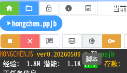
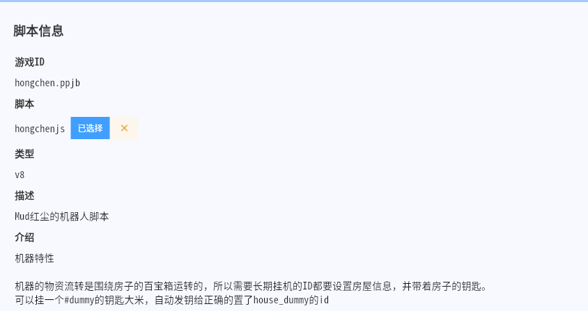
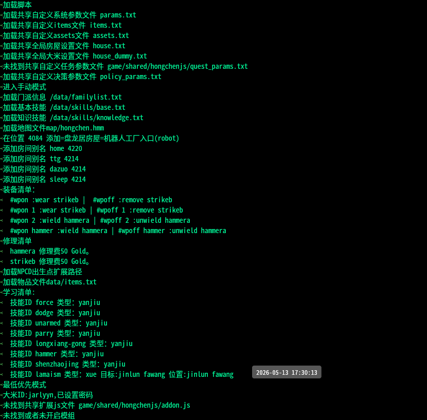
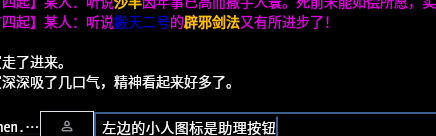

# HONGCHENGJS 使用说明

hongchenjs是一款运行于hellclient上，针对**中华英雄**Mud开发的多功能全自动机器。

## 使用准备

您需要在Hellclient里开启一个新的游戏，然后点击 脚本 按钮，选中hongchenjs，就可以使用本脚本了。



*脚本按钮*



*选中脚本*

在成功加载hongchengjs后，mud游戏窗口一般会出现一系列的加载提示，如下图



## 助理按钮

整个机器操作的最核心入口是 输入框左侧的助理按钮



点击后会出现机器人的核心主菜单


## 基础指令

* #start 开始任务

* #stop 停止任务

* #login 登陆界面输入账号，密码，y

## 

## 设置引导

机器人有7个变量是必设的

* ID 用户ID

* Password 用户密码

* Combat 战斗指令

* Command 用户指令

* Weapon 装备设置

* Items 道具设置

* jifa 武功激发

对于这几个变量，如果有任何一个是空，在助理菜单里就会出现设置引导的选项，通过对话框的方式进行初始化。

如果id发生了变化，也可以将对应的变量情况，设置引导会尝试对对应的变量进行初始化

## 房屋及大米设置

hongchenjs对于物资管理是基于房屋及大米的，分别对应

* house

* house_dummy

两个变量

house变量的格式为

* 机器人工厂 robot 4084 password

* d小房子 smallhouse 2785

* c黑灯工厂 factory 2785

这样的格式，具体指令见变量说明

house_dummy的话有两种格式。带密码和不带密码

带密码格式为

* dummy_id password

大米需要通过hongchenjs运行#dummy任务，会自动索要钥匙，黄金等

不带密码的格式为

* dummy_id

这样只是确定大米的聊天室。

如果 大米密码，钥匙，房屋信息都有，所有的物资会通过房子的百宝箱进行交互。

如果确这3个种的某个信息，或者在#items里设置了#nobox,则会尝试通过聊天室来进行物资处理。

由于同一个机器的房屋和大米设置一般是一致的。你可以在服务game/shared/hongchenjs/

里新建

* house.txt

* house_dummy.txt

内容和变量一致(**注意使用utf8编码**),则在没有设置变量时会默认使用txt文件中的设置

## 移动设置

移动设置主要就是两个变量

* cmd_ride

坐骑设置，设置为你ride坐骑的指令，比如

```
ride ppjb-feiji
```

* miss_list

miss列表

```
hszz|4109
//注意这个变量支持注释，方便动态切换
```

## 任务编排

hongchenjs的底层框架支持多任务按顺序编排的。

具体就是在quest中，可以一行一个，附带条件按的执行任务。

比如

```
lianskill
chujian
mq
freequest 追杀
```

就是依次尝试

1. 练功，功夫练满了在执行之后的

2. 锄奸，cd了再执行后面的

3. MQ师门任务，不能做任务了(需要做fq)了再执行之后的

4. freequest 追杀，做追杀

能很自由的编排任务。

使用#start指令就能开始任务， #stop就能停止任务

#start 也可以跟参数执行一次性任务，用||代替换行。比如上面的任务可以看作以下写法

```
#start lianskill||chujian||mq||freequest 追杀
```

由于红尘的任务功能性比较强，我预设了一批常见的命令作为别名(可以在quest变量里单放一行#开头的别名)，方便快速所任务

* #mq
  #start lgt||chujian||mq||freequest 追杀
  lgt>chujian>mq>freequest的方式做任务

* #mq0
  #start nojiqu||lgt||chujian||!full>>mq||!full>>freequest 追杀||baohu||lianskill
  禁用默认汲取设置，优先灵感塔，锄奸，mq,追杀，如果体会满了做保护
  适合高技能等级有10lv的id通过baohu消体会

* #mq1
  #start nojiqu||lgt||!full>>mq||!full>>freequest 追杀||baohu||chujian||lianskill
  禁用默认汲取设置，优先灵感塔，mq,追杀，如果体会满了做保护锄奸
  适合有10lv的id通过baohu消体会,和#mq0的区别是是否优先锄奸

* #mq2
  #start lgt||mq||freequest 追杀
  做lgt mq

* #mq3
  #start lianskill||mq||freequest 追杀
  
  练满技能，做mq,适合没10lv的id

* #mq4
  #start lianskill||chujian||mq||freequest 追杀
  练功锄奸mq,比较不常用

* #tianlao
  #start tianlao||lianskill||idle
  天牢发呆，适合单挂天牢的id

* #tianlao2
  #start tianlao||lianskill||mq||freequest 追杀||idle
  天牢混mq,专业打资源

* #tianlao3
  #start tianlao||lianskill||baochu||chujian||idle
  天牢混保护，主打magic water和bug点

* #baohu
  #start baohu||chujian||lianskill||idle
  纯打bug点

* #noob
  #start study !drawing|31|xue|lu ban|lu ban||maxexp 50000>>tianlao||skill drawing 30,yueli 2000,!maxexp 50000>>funquest||maxexp 100000,!maxexp 50000,yueli 20>>letter||maxexp 800000,!maxexp 50000>>changanjob||maxexp 300000>>peiyao||lianskill||idle
  
  从exp0开始一条龙做任务,包含学drawing,tianlao,fq,changanjob,送信，配药，练功

* #noob2
  
  #start study !drawing|31|xue|lu ban|lu ban||tianlao||skill drawing 30,yueli 2000,!maxexp 50000>>funquest||maxexp 100000,!maxexp 50000,yueli 20>>letter||maxexp 800000,!maxexp 50000>>changanjob||maxexp 300000>>peiyao||lianskill||idle
  牛逼ID的一条龙，区别是一直做天牢

## 学习设置

学习设置由以下几个变量确定

* max_exp 最大经验，设为0不放弃经验

* max_pot 最大潜能，潜能超过这个值去学习，设为0不学习

* min_pot 最小潜能，尝试保持多少潜能

* study 学习列表

* lian 练习列表

* jiqu 汲取设置，留空自动，设0强制不汲取

max_exp支持 +0的格式，就是自动根据最高的武学等级，计算需要的exp

study和lian完全是同一个格式两个场合使用的指令

完整格式为

```
技能ID|学习限制|类型|目标|位置|开始指令|结束指令
```

除了技能id都可以省略。

* 学习限制
  学习限制可以由逗号分割，代表多个限制
  纯数字限制：最多学习到该等级
  其他技能id:不超过该技能
  其他技能id空格+数字：不超过该技能+等级
  其他技能id空格-数字：不超过该技能-等级
  其他技能id空格*数字:不超过该技能的指定比例

* 类型：支持xue,yanjiu,lian,cmd,du
  study变量中默认为yanjiu
  lian变量中默认为lian

* 目标取决于类型不同，效果不同
  xue 学习的目标
  lian jifa的基础技能
  
  cmd 执行的指令
  du 执行的指令(du相比cmd会加入一秒延迟)

* 位置，具体的坐标，可以用Marker中的地标，比如注册过的NPC ID

* 开始指令 一般用于装备/卸武器

* 结束指令 一般用于配合开始指令装/卸武器

**如果要有限学习的技能，可以在最前方加入!感叹号符号**

其他技能会优先学最低，所以一般所有技能是平的，不会有特别高和低的技能

对于study变量来说，如果在learn阶段，可以通过助理菜单的

```
选择师傅初始化学习清单，需要在师傅房间
```

来选择学习的技能的清单。

研究阶段，一行一个要研究的技能id即可，如

```
force
dodge
parry
unarmed
huntian-baojian
```

对于lian变量来说，可以通过助理菜单的

```
初始化练习清单
```

选择练习设置

## 物资管理

物资管理变量一般是通过

* items

* sell

两个变量来进行设置

items变量是需要准备的道具，一行一个

默认是从script/data/items.txt中注册过的道具中取

可以用#qu feicui lan的格式设置从箱子/聊天室取道具

sell变量则完全是扩展了 script/data/assets.txt中的设置。

一行一个。

格式如下

```
#home id=xxxx
//#home表示要保存的道具
#sell id=xxxx
//#sell表示要卖掉的道具
#drop id=xxxx
//#drop 表示要丢弃的道具
#home.10 id=huogu lingyao * 20
//最多带20个huogu lingyao,超过了去存10个
#home id=feicui lan * 2
//表示最多带2个翡翠兰.lan不能堆叠，所以不设一次存几个
```

由于物资管理一般也是全局的

所以可以通过

* appdata/game/shared/hongchenjs/items.txt

* appdata/game/shared/hongchenjs/assets.txt

统一设置

## 决策管理

决策管理是通过助理菜单的决策设置按钮进行操作的

决策管理指某些全局的指令，不适合在任务编排中进行设置的部分。

目前包含以下方面

* 重生处理

* 死亡保护，吃天书设置

* 自动吃露

* 自动闭关 breakup/animatout/deatch一套

* 自动冥思

* 天神之光

对应的设置保存在policy_params变量中，正常不应该手动设置。

同样的，可以在

- appdata/game/shared/hongchenjs/policy_params.txt

中统一设置

## 其他设置

hongchenjs还有系参数设置和任务参数设置两个设置，

比较杂，可以看下具体说明

对应的变量是

* params

* quest_params

也不要手动设置。

同样的，可以在

* appdata/game/shared/hongchenjs/params.txt

* appdata/game/shared/hongchenjs/quest_params.txt

中进行全局设置

## 别名队列

hongchenjs内建一套用户指令队列操作，包括

* #to 到达指定位置，位置可以是注册过的marker

* #preapre 准备

* #nobusy 等待忙

* #loop 循环

* #kill kill当前房间npc

* #wait 等待指定时间

* #sync 同步

* #qu 从箱子里取指定道具

通过|| 可以组合成队列循环执行，比如

```
#prepare||#to 4186||yun regenerate||du taben 50||#loop
```

的形式循环指定指令

同时，由于去练功地重复执行指令太常见了，所以我做了个#repeat 别面。

如果要读身上的几个book,可以

```
#repeat du book 100||du book 2 100||du book 3 100
```

来循环读3本书

## San武器

主id 使用#sanmy weapon id开始

大米使用 #san weapon id 开始

 san玩可以通过#eatwan 2000 这样的格式把精力补到2000

#eatwan不带参数的话就是吃到精力满

## 其他物资

hongchenjs还有一些获取其他物资的指令

* #fuse xxx fuse

* #wuhuaguo  xxx合成无花果

* #tianshu xxx合成天书

* #blesswater xxx 合成bleswater

以上指令需要指定需要生成多少数量

* #shenzhaojing 获取 shenzhao jing

* #zhangjin 大保健id生成zhang jin

以上指令不需要指定数量

## 危险指令

危险指令是处于特殊需求设置的，需要小心使用

* #fangqi xxxx.

选择并放弃技能等级小于制定等级的技能。不带参数则选择面包括所有技能。有部分技能为保护状态，不会出现在列表内

* #cleanhouse

按assets规则清理箱子

## 常用读书指令

yjj

```
#prepare||#to 4187||du yijin jing 100||hp||#nobusy||#loop
```

读force(lian)

```
force|200|du|du zhenjing taben 100|4186
```

读峨眉九阳(lian)

```
emei-jiyang|180,@force 100|du|du emei jiuyang 100|4183
```


读残章

```
#prepare||#to 4185||du can zhang 100||hp||#nobusy||#loop
#prepare||#to 4185||yun regenerate||yanjiu zhao from can zhang ||hp||#nobusy||#loop
```

论语(lian)

```
literate|120|du|du literate book4 100|4187
```

有10lv的全真id,初期shot天牢的lian设置，需要买literate book，force book 和dodge book在身上

```
!literate|100|du|du literate book1 100;du literate book2 100;du literate book3 100|dazuo
!literate|120|du|du literate book4 100|4187
!force|100|du|du force book 100;du force book 2 100|dazuo
!emei-jiuyang|force @100,180|du|du emei jiuyang 100|4183
!dodge|100|du|du dodge book 100;du dodge book 2 100|dazuo
tianshan-feidu|dodge|lian|dodge|
```

正气

```
#repeat du zhengqi_book 100||fangqi zhengqijue||score||hp
```

邪气

```
#repeat du tianmo jue 100||fangqi tianmojue||score||hp
```

参悟洗髓经

非sl的要杀kong jian,别忘记要过罗汉大阵

如果只有1把10lv,要设置miss,把10lv设为miss.同时在weapon里把10lv用//注释掉，如下

```
toucha|3967
```

把武器也要插在3967

然后

```
#prepare||#to 3847||yun regenerate||#10 canwu xisui jing||hp||#nobusy||#loop
```
